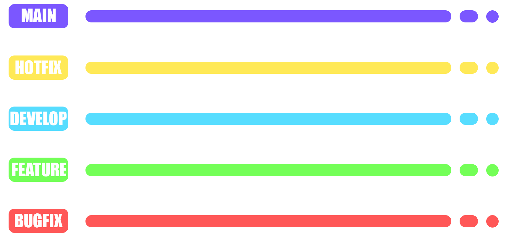

## MAIN
main branch of the project. Only ready (release) changes are merged here.

## HOTFIX
Branch for quick minor changes. There are also changes to documentation files here.

## DEVELOP
The main working branch of the project. From it, features and bugfixes are created and merged here.

## FEATURE
Creation of new functionality.

## BUGFIX
This branch is needed for corrections in the code.